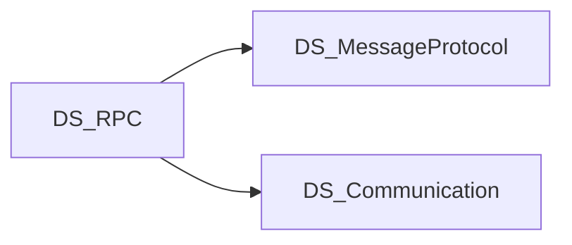

# Scope

## 목적

게임/실시간 앱을 위한 TCP·RUDP 네트워크 전송 계층을 제공한다.

## In scope

- TCP / TCP IOCP / RUDP 클라이언트·서버 스택 (`Source/` 10패키지)
- 세션·메시지 전송 추상화 (`Communication.Shared`)
- length-prefix TCP 프레이밍, RUDP DeliveryMethod (`ReliableType`)
- Unity / netstandard2.1 호환 런타임
- Sandbox 샘플 (Chat, RUDP_Chat, TCP_IOCP_Chat)

저장소 레이아웃·원칙: [[Overview]]

## Out of scope

- 메시지 직렬화 포맷 (→ DS_MessageProtocol)
- 고수준 RPC / 원격 프로시저 호출 (→ DS_RPC)
- 애플리케이션 비즈니스 로직

## 의존·형제 프로젝트

- **상위 소비자**: DS_RPC가 RUDP 등 Communication 패키지를 NuGet으로 참조
- **형제**: DS_MessageProtocol (직렬화는 별도; Communication은 전송에 집중)

## 관련

- [[CONTEXT]]
- [[Home]]
- [[Packages]]