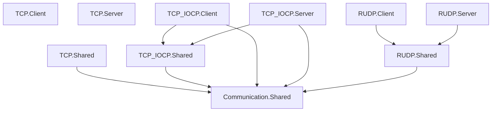

# Components

패키지/어셈블리 단위 컴포넌트 맵.

## 의존 그래프

TCP Client/Server 프로젝트는 Shared에 대한 ProjectReference가 없다. 앱이 `TCP.Shared`(+ `Communication.Shared`)와 Client/Server를 **함께** 참조하는 패턴이다 (Sandbox Chat).

## 상세

| 컴포넌트 | 책임 | 의존 | 주요 경로 |
|----------|------|------|-----------|
| `Communication.Shared` | 세션·메시지 추상화, Handler 큐 | System.Buffers, System.Memory | `Session/`, `Messages/` |
| `Communication.Network.TCP.Shared` | TcpClient 기반 Session·Sender·Receiver | Shared | `Session/TCPSession.cs`, `Message/TCPMessage*.cs` |
| `Communication.Network.TCP.Client` | `TCPConnector` (host/port → TcpClient) | (없음) | `TCPConnector.cs` |
| `Communication.Network.TCP.Server` | `TCPListener` (Accept 루프) | (없음; EF Tools PrivateAssets) | `TCPListener.cs` |
| `Communication.Network.TCP_IOCP.Shared` | Socket 기반 Session·Sender·Receiver | Shared | `Session/`, `Message/` |
| `Communication.Network.TCP_IOCP.Client` | `TCPConnector` (SocketAsyncEventArgs Connect) | Shared, TCP_IOCP.Shared | `TCPConnector.cs` |
| `Communication.Network.TCP_IOCP.Server` | `TCPListener` (Socket Accept) | Shared, TCP_IOCP.Shared | `TCPListener.cs` |
| `Communication.Network.RUDP.Shared` | LiteNetLib Session·Sender·Receiver·Dispatcher | Shared, LiteNetLib 1.3.5 | `Session/RUDPSession.cs`, `Message/` |
| `Communication.Network.RUDP.Client` | `RUDPConnector` (NetManager Connect + poll) | RUDP.Shared | `RUDPConnector.cs` |
| `Communication.Network.RUDP.Server` | `RUDPListener` + ReceiveDispatcher | RUDP.Shared | `RUDPListener.cs` |

### Shared 내부

| 타입 | 역할 |
|------|------|
| `ISession` / `Session` | SendAsync, Disconnect, Receiver/Sender 수명 |
| `IMessageConverter` | `Serialize` / `Deserialize` |
| `IMessageSender` / `MessageSender` | 송신 추상 |
| `IMessageReceiver` / `MessageReceiver` | 수신 추상 |
| `IMessageHandler` / `MessageHandler` | 타입별 핸들러 등록, 수신 큐 비동기 처리 |

### RUDP 전용

| 타입 | 역할 |
|------|------|
| `RUDPNetworkReceiveDispatcher` | peer별 Receiver로 NetworkReceiveEvent 분배 (단일 구독) |
| `MessageSendContext` / `ReliableType` | LiteNetLib DeliveryMethod 매핑 |

## Sandbox

| 샘플 | 스택 | 구성 |
|------|------|------|
| `Sandbox/Chat` | TCP | Server, ClientGUI, BotTest, Shared, DB (EF/SQLite) |
| `Sandbox/RUDP_Chat` | RUDP | Client, Server, Shared |
| `Sandbox/TCP_IOCP_Chat` | TCP_IOCP | Client, Server, Shared |

공통 패턴: `DefaultMessageConverter`, `*Session` (TCPSession/RUDPSession 상속), `*MessageHandler`, 연결 콜백에서 세션 생성.

## 관련

- [[Overview]]
- [[Packages]]
- [[Data-Flow]]
- [[Public-API]]
