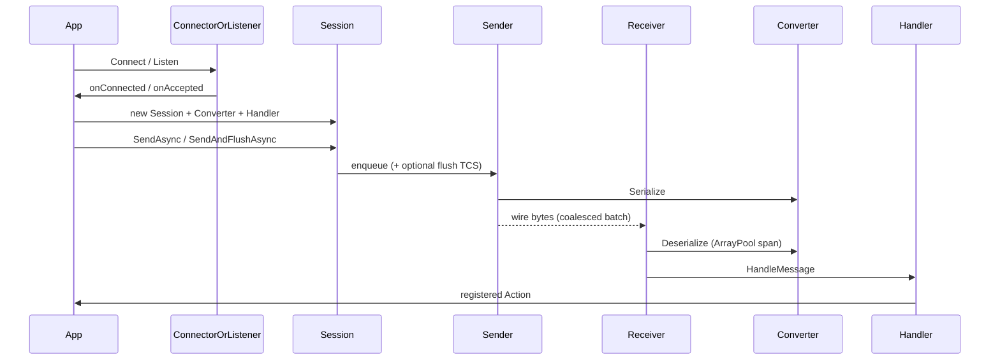

# Data Flow

요청·메시지·패킷이 시스템을 통과하는 경로. (TCP coalesce·ArrayPool 수신, `SendAndFlushAsync`, RUDP `PollIntervalMs`·AcceptIfKey 반영)

## Happy path (공통)

1. **연결** — Client: `*Connector.ConnectAsync(...)`; Server: `*Listener.Start` + `ListenAsync` / peer 이벤트.
2. **세션** — 콜백에서 `TcpClient` / `Socket` / `NetPeer`로 앱 Session 생성. Receiver·Sender factory에 `IMessageConverter`·`IMessageHandler` 주입.
3. **송신** — `Session.SendAsync`는 큐잉 후 즉시 반환. `SendAndFlushAsync`는 해당 메시지가 wire에 쓰일 때까지 await. Sender는 drain 시 여러 메시지를 ~64KB까지 **coalesce**해 단일 Write.
4. **수신** — Receiver가 body를 `ArrayPool`로 읽고 `Deserialize(span)` → `Handler.HandleMessage`. `InlineDispatch`면 Handler 큐 없이 동기 디스패치.

## TCP (및 TCP_IOCP)

프레이밍: **4바이트 little-endian length** + payload.

**송신** (`TCPMessageSender`):

1. `Serialize(message)` → `byte[]` (계약상 할당 — [[Known-Issues]])
2. 백프레셔(`MaxPendingMessages`) 후 큐 enqueue; idle이면 송신 루프 기동
3. drain에서 length+payload를 ArrayPool 버퍼에 이어 붙인 뒤 **단일 WriteAsync** (flush 경계에서 배치 종료)

**수신** (`TCPMessageReceiver`):

1. length 4바이트 완전 읽기
2. body `ArrayPool` Rent → 읽기 → `Deserialize(span)` → Return
3. stream 종료(0 bytes) 시 `OnDetectedDisconnection` → `MarkDisconnected`

TCP는 `NetworkStream`(TcpClient), TCP_IOCP는 `Socket` 기반 동일 length-prefix 계약.

## RUDP

**연결**

- Client: `NetManager` 시작 → `Connect(host, port, connectionKey)` → PeerConnected (타임아웃 약 5초) → poll 루프 (`PollIntervalMs`, 기본 1)
- Server: `AcceptIfKey(connectionKey)` → peer 콜백; `RUDPNetworkReceiveDispatcher`가 peer별 Receiver에 분배

**송신** (`RUDPMessageSender`):

1. context가 `MessageSendContext`이면 `ReliableType` → LiteNetLib `DeliveryMethod`
2. 기본: `ReliableOrdered`
3. 큐 → `NetPeer.Send` (`SendAndFlushAsync` 지원)

**수신**

1. Dispatcher → `RUDPMessageReceiver.DispatchFromNetwork`
2. Deserialize → HandleMessage
3. 미등록 peer 패킷은 `Recycle`

## 에러·재시도·종료

| 상황 | 동작 |
|------|------|
| TCP Connect 실패 / cancel | `ConnectAsync` → `false` |
| RUDP 연결 타임아웃·실패 | StopInternal 후 `false` |
| 송신 중 예외 | Sender 루프에서 Trace; flush TCS는 fault |
| 수신 중 끊김 | `OnDetectedDisconnection` → 로컬 disconnect 플래그 |
| `Session.Disconnect` | transport가 살아 있으면 `OnDisconnected` 후 `Dispose` |
| RUDP Session Dispose | NetPeer/NetManager는 외부 소유 |

라이브러리 수준 자동 재연결은 없다. 재시도는 앱 책임.

## 관련

- [[Overview]]
- [[Components]]
- [[Public-API]]
- [[Configuration]]
- [[FAQ]]
- [[Known-Issues]]
