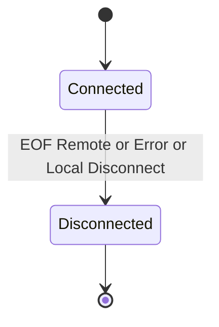

# Data Flow

## Happy path

1. `ConnectAsync` → `bool` + Channel; Accept → Channel. **앱이 `new *Session`**.
2. Send → Pipeline → Channel. Receive → Deserialize → `HandleMessage`.
3. 끊김 → `Disconnected(Reason)`. **재접속은 앱** (새 Connect + 새 Session).

## 연결 끊김



| Reason | 의미 |
| -------- | ------ |
| `Local` | `Session.Disconnect()` |
| `Remote` | 상대 종료 (스트림 끝, RUDP peer 끊김) |
| `Error` | 전송/프레이밍 예외 |
| `Timeout` | 수신 프레임 완료 마감 초과 (`FrameTimeout`) |

앱 재접속(라이브러리 밖):

```text
Disconnected(Remote|Error) → backoff → ConnectAsync → new Session → (서버) 토큰 핸드셰이크
```

서버는 Accept마다 **새 Session**. 논리 유저는 앱 딕셔너리/토큰으로 매핑.

## TCP keep-alive

Connector/Listener 옵션 `KeepAlive` → 소켓에 적용. 앱 ping과 별개. [[../03-Reference/Configuration|Configuration]]

## 스트림 / RUDP 수신 경로

```text
스트림(TCP·TCP_IOCP):
  Channel.ReadAsync 루프 → LengthPrefixFrameReader → Deserialize → 디스패치 큐 → Handler

RUDP:
  폴링 스레드 PollEvents → MessageReceived(payload) → Deserialize → 디스패치 큐 → Handler
```

- RUDP는 전송이 메시지 경계를 주므로 **Framer가 없고 수신 루프도 없다** — 그래서 원격 끊김을 스스로 감지하지 못하고, 채널의 peer 끊김 통지를 `RudpSession`이 `Disconnected`로 이어 붙인다.
- 앱 핸들러는 어느 경로에서든 **세션별 디스패치 큐**에서 돈다 — RUDP 폴링 스레드(호스트당 1개, 접속 수와 무관)를 점유하지 않으므로 느린 클라이언트 1개가 다른 접속을 막지 못한다.
- payload는 수신 콜백 안에서만 유효하다 (`IMessageChannel` 계약).

상세: [[../04-Guides/Getting-Started|Getting-Started]], [[Pipeline]], [[Channel]], [[../05-Decisions/0007-rudp-three-way-split-and-polling|ADR 0007]].

## 에러·종료

| 상황 | 동작 |
| ------ | ------ |
| Connect 실패 | `false` |
| 수신 끊김 | `Disconnected(Remote)` 또는 `Error` |
| `Disconnect()` | `Disconnected(Local)` |
| 앱 재접속 | 새 Session — 라이브러리 이벤트 없음 |

## 관련

- [[0003-connection-lifecycle-options]]
- [[0006-session-ownership-and-converter]]
- [[../03-Reference/Public-API|Public-API]] · [[../03-Reference/Configuration|Configuration]]
