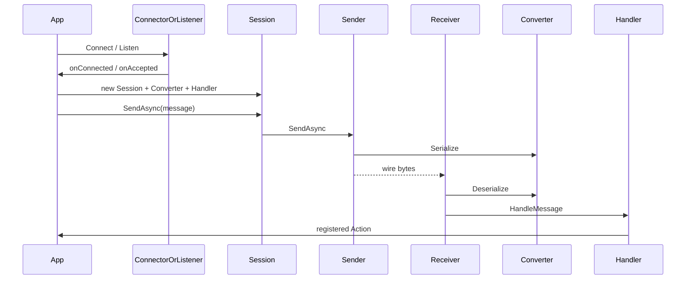

# Data Flow

요청·메시지·패킷이 시스템을 통과하는 경로.

## Happy path (공통)

1. **연결** — Client: `*Connector.ConnectAsync(...)`; Server: `*Listener.Start` + `ListenAsync` / peer 이벤트.
2. **세션** — 콜백에서 `TcpClient` / `Socket` / `NetPeer`로 앱 Session 생성. Receiver·Sender factory에 `IMessageConverter`·`IMessageHandler` 주입.
3. **송신** — `Session.SendAsync` → Sender 큐 → 직렬화 → 전송.
4. **수신** — Receiver 루프/이벤트 → 역직렬화 → `Handler.HandleMessage` → 타입별 Action 큐 처리.

## TCP (및 TCP_IOCP)

프레이밍: **4바이트 little-endian length** + payload.

**송신** (`TCPMessageSender`):

1. `Serialize(message)` → `byte[]`
2. 큐 enqueue 후 송신 루프가 `Write(length 4B)` + `Write(payload)` + Flush

**수신** (`TCPMessageReceiver`):

1. length 4바이트 완전 읽기 (부분 읽기 시 재시도)
2. body `length` 바이트 읽기
3. `Deserialize` → `HandleMessage`
4. stream 종료(0 bytes) 시 `OnDetectedDisconnection`

TCP는 `NetworkStream`(TcpClient), TCP_IOCP는 `Socket` 기반 동일 length-prefix 계약.

## RUDP

**연결**

- Client: `NetManager` 시작 → `Connect(host, port, connectionKey)` → PeerConnected (타임아웃 약 5초) → poll 루프 유지
- Server: `ConnectionRequestEvent` Accept → `PeerConnectedEvent`에서 앱 콜백; `RUDPNetworkReceiveDispatcher`가 NetworkReceiveEvent를 peer별 Receiver에 분배

**송신** (`RUDPMessageSender`):

1. context가 `MessageSendContext`이면 `ReliableType` → LiteNetLib `DeliveryMethod`
2. 기본: `ReliableOrdered`
3. 큐 → `NetPeer.Send`

**수신**

1. Dispatcher `OnNetworkReceive` → 등록된 `RUDPMessageReceiver.DispatchFromNetwork`
2. Deserialize → HandleMessage
3. 미등록 peer 패킷은 `Recycle` (다른 세션 패킷 유실 방지 설계)

## 에러·재시도·종료

| 상황 | 동작 |
|------|------|
| TCP Connect 실패 / cancel | `ConnectAsync` → `false` |
| RUDP 연결 타임아웃·실패 | StopInternal 후 `false` |
| 송신 중 예외 | Sender 루프에서 로그 후 계속 (또는 연결 끊김으로 이어짐) |
| 수신 중 끊김 | `OnDetectedDisconnection` → Handler |
| `Session.Disconnect` | `IsConnected`면 `OnDisconnected` 후 `Dispose` (Receiver/Sender dispose) |
| RUDP Session Dispose | NetPeer/NetManager는 외부 소유 — Session이 dispose하지 않음 |

라이브러리 수준 자동 재연결은 없다. 재시도는 앱 책임.

## 관련

- [[Overview]]
- [[Components]]
- [[Public-API]]
- [[FAQ]]
