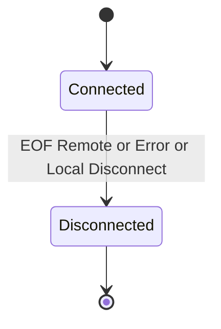

# Data Flow

## Happy path

1. `ConnectAsync` → `bool` + Channel; Accept → Channel. **앱이 `new *Session`**.
2. Send → Pipeline → Channel. Receive → Deserialize → `HandleMessage`.
3. 끊김 → `Disconnected(Reason)`. **재접속은 앱** (새 Connect + 새 Session).

## 연결 끊김



| Reason | 의미 |
|--------|------|
| `Local` | `Session.Disconnect()` |
| `Remote` | 상대 종료 |
| `Error` | 전송/프레이밍 예외 |

앱 재접속(라이브러리 밖):

```text
Disconnected(Remote|Error) → backoff → ConnectAsync → new Session → (서버) 토큰 핸드셰이크
```

서버는 Accept마다 **새 Session**. 논리 유저는 앱 딕셔너리/토큰으로 매핑.

## TCP keep-alive

Connector/Listener 옵션 `KeepAlive` → 소켓에 적용. 앱 ping과 별개. [[Configuration]]

## 스트림 / RUDP

[[Getting-Started]], [[Pipeline]], [[Channel]].

## 에러·종료

| 상황 | 동작 |
|------|------|
| Connect 실패 | `false` |
| 수신 끊김 | `Disconnected(Remote)` 또는 `Error` |
| `Disconnect()` | `Disconnected(Local)` |
| 앱 재접속 | 새 Session — 라이브러리 이벤트 없음 |

## 관련

- [[0003-connection-lifecycle-options]]
- [[0006-session-ownership-and-converter]]
- [[Public-API]] · [[Configuration]]
