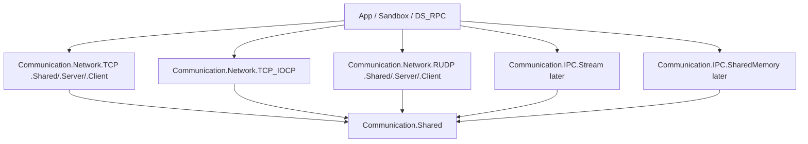

# Architecture Overview

연결형 통신 **전송 계층**. Shared 계약 위에 전송 패키지가 올라가고, 앱은 Session만 본다. 직렬화·RPC는 포함하지 않는다 (→ DS_MessageProtocol, DS_RPC).

## 계층

| 계층 | 역할 | 대표 |
| ------ | ------ | ------ |
| Session / Message | 연결 수명, 송신 큐·coalesce, Handler, Converter | `ISession`, `MessagePipeline` |
| Connection lifecycle | 끊김 통지 (`DisconnectReason`). 재접속·하트비트는 앱. TCP keep-alive는 전송 옵션 | `Disconnected`, `SocketKeepAliveOptions` |
| Framing | 스트림 메시지 경계 (4B LE length-prefix) | `LengthPrefixFramer` |
| Byte channel | 연결형 바이트 I/O | `IByteChannel` — TCP, TCP_IOCP, IPC.Stream |
| Message channel | 메시지 단위 I/O | `IMessageChannel` — RUDP (`RudpMessageChannel`) |
| Shared-memory channel | 슬롯/링버퍼 (후속) | `ISharedMemoryChannel` |

## 원칙

1. **전송만** — 바이트·메시지 송수신과 연결 수명. 포맷은 Converter 주입. **하트비트는 앱**.
2. **Session 중심** — 앱 API는 전송과 무관하게 `ISession`.
3. **채널로 I/O 차이 흡수** — TCP·TCP_IOCP·IPC.Stream은 `IByteChannel`+Framing, RUDP는 `IMessageChannel`.
4. **스택별 패키지 구성** — TCP·RUDP는 Shared/Server/Client **3분할**(서버·클라이언트 독립 설치), TCP_IOCP·IPC는 1 패키지. 「스택당 1 패키지」 초기 규칙은 폐기 — [[0007-rudp-three-way-split-and-polling]].
5. **스택 선택은 패키지 참조** — TCP와 TCP_IOCP를 한 패키지로 합치지 않는다.
6. **수명** — 끊김은 `Disconnected(Reason)`만. 재접속·하트비트는 앱. TCP keep-alive는 사용자 설정 ([[0003-connection-lifecycle-options]]).
7. **SendOptions 상속** — Shared `SendOptions`, RUDP는 `RudpSendOptions` 등 — [[0004-send-options-and-handler-api]].
8. **netstandard2.1** — Unity·다중 런타임.

## 확장 경로

구현 순서·Sandbox: [[Implementation-Roadmap]].

| 단계 | 내용 |
| ------ | ------ |
| 1 | Shared + Test ✅ |
| 2 | Network.TCP + Test + Sandbox 채팅 ✅ |
| 3 | Network.RUDP (LiteNetLib) + Test + Sandbox ✅ |
| 4 | Network.TCP_IOCP + Test + Sandbox |
| 5 | IPC.Stream / SharedMemory; 자체 RUDP는 별 프로젝트 |

결정 근거: [[0001-transport-channel-abstraction]], [[0002-tcp-backend-selection]], [[0003-connection-lifecycle-options]], [[0004-send-options-and-handler-api]], [[0005-rudp-litenetlib-interim]], [[0006-session-ownership-and-converter]], [[0007-rudp-three-way-split-and-polling]]

## 관련

- [[Code-Structure]]
- [[Data-Flow]]
- [[Components]]
- [[Session]]
- [[Pipeline]]
- [[Channel]]
- [[Handler]]
- [[Public-API]]
- [[Implementation-Roadmap]]
- [[Packages]]
- [[Scope]]
