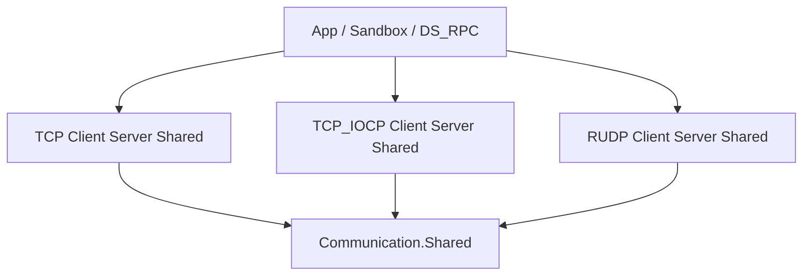

# Architecture Overview

TCP / RUDP 네트워크 **전송 계층** 라이브러리. `Communication.Shared` 추상화 위에 TCP, TCP_IOCP, RUDP 세 스택이 올라간다. 직렬화·RPC는 포함하지 않는다 (→ DS_MessageProtocol, DS_RPC).

## 저장소 트리

```
DS_Communication/
├── Communication.sln
├── Directory.Build.props          # 기본 IsPackable=false
├── Source/                        # NuGet 패키지 (netstandard2.1)
│   ├── Directory.Build.props      # IsPackable=true, TFM, XML docs
│   ├── Communication.Shared/
│   ├── Communication.Network.TCP.{Client,Server,Shared}/
│   ├── Communication.Network.TCP_IOCP.{Client,Server,Shared}/
│   └── Communication.Network.RUDP.{Client,Server,Shared}/
├── Sandbox/                       # 샘플 (패키징 제외)
│   ├── Chat/                      # TCP + GUI/DB
│   ├── RUDP_Chat/
│   └── TCP_IOCP_Chat/
└── Document/                      # Obsidian vault
```

## 계층



| 계층 | 역할 | 대표 타입 |
|------|------|-----------|
| Shared | 세션·메시지 계약 | `ISession`, `Session`, `IMessageConverter`, `MessageHandler` |
| *.Client | 아웃바운드 연결 | `TCPConnector`, `RUDPConnector` |
| *.Server | 인바운드 수락 | `TCPListener`, `RUDPListener` |
| *.Shared (전송) | 세션·송수신 구현 | `TCPSession` / `RUDPSession`, `*MessageSender` / `*MessageReceiver` |

## 주요 원칙

1. **전송만** — 바이트 송수신·연결 수명. 메시지 포맷은 `IMessageConverter`로 앱이 주입.
2. **Session 중심** — `Session`이 `IMessageSender` / `IMessageReceiver`를 생성·소유하고 `Dispose` 시 함께 정리.
3. **스택 선택** — 동일 Shared 계약 위에 TCP(TcpClient/NetworkStream), TCP_IOCP(SocketAsyncEventArgs), RUDP(LiteNetLib) 중 선택.
4. **netstandard2.1** — Unity 및 다중 .NET 런타임 호환.

## 관련

- [[Components]]
- [[Data-Flow]]
- [[Packages]]
- [[CONTEXT]]
