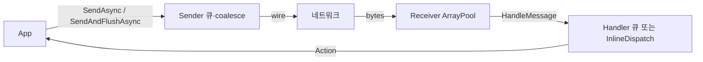

# Known Issues — 구조·성능·병목·해결 방안

코드 기준 분석일: **2026-07-11**. 사용법 함정은 [[FAQ]], 런타임 경로는 [[Data-Flow]], 패키지 맵은 [[Components]]. ADR: [[0001-transport-pipeline-unification]].

## 1. 현재 구조 요약

```
Source/
├── Communication.Shared          # ISession, Session, Converter/Sender/Receiver/Handler, SignalGate, MessageQueueOptions
├── Communication.Network.TCP.{Client,Server,Shared}
├── Communication.Network.TCP_IOCP.{Client,Server,Shared}
└── Communication.Network.RUDP.{Client,Server,Shared}
```

세션당 런타임 파이프라인(개념):



상세: [[Overview]], [[Components]], [[Data-Flow]].

---

## 2. Fixed (이미 반영)

| 이슈 | 조치 |
|------|------|
| `SemaphoreSlim(0,1)` 연속 `Release` | `SignalGate` (Interlocked + 단일 시그널) — Shared 공용 |
| `Session.SendAsync(..., context)` context 무시 | Sender에 context 위임 |
| TCP_IOCP Accept pending 무한 재투기 | Accept 1건 → TCS 대기 → 다음 |
| TCP_IOCP `_isSending` 레이스 | `Interlocked` + 큐 더블체크 |
| TCP 메시지마다 Flush / 이중 Write | Flush 제거, length+payload 단일 Write; coalesce 배치(~64KB) |
| RUDP Poll 15ms | `PollIntervalMs` (기본 1) |
| RUDP `connectionKey` 미검증 | `AcceptIfKey` |
| Accept마다 `Task.Run` | `_ = onClientAccepted(...)` |
| `MessageHandler` Dispose / `async void` | Cancel→Release→Wait; `async Task` |
| TCP.Server EF Core Tools | PackageReference 제거 |
| Unbounded 큐 백프레셔 | `MessageQueueOptions.MaxPendingMessages` (기본 10_000) |
| 세션당 Handler Task | `InlineDispatch` 옵션 |
| Send 완료 await 불가 | `SendAndFlushAsync` (TCS flush 경계) |
| 수신 `new byte[length]` | `ArrayPool<byte>.Shared` Rent/Return |
| IOCP length 4B 할당 | `BitConverter.TryWriteBytes` |
| Handler 미등록 타입 throw | Trace + skip |
| `IsConnected` transport만 의존 | 로컬 `_locallyConnected` + transport AND (`MarkDisconnected`) |
| 테스트·관측성 부재 | `Test/Communication.Tests` (SignalGate, MessageHandler, TCP loopback) |
| 네임스페이스 불일치 (신규) | canonical `Communication.Network.*` + legacy `Communication.TCP.*` 호환 별칭 |
| 스택 3벌 복제 (단기) | Shared `SignalGate` / `MessageQueueOptions` 추출 — 전체 파이프라인 통합은 [[0001-transport-pipeline-unification]] |

---

## 3. Open

### 3.1 Converter `Serialize` → `byte[]` 할당 (P1, major 대기)

**문제**

`IMessageConverter.Serialize(object)`가 `byte[]`를 반환하도록 계약되어 있어, 송신마다 힙 할당이 강제된다. Sender coalesce·ArrayPool은 wire 쓰기를 줄이지만 Serialize 결과 배열 자체는 제거하지 못한다.

**영향**

연결 수 × 메시지 비율로 GC 압박이 남는다. Unity 모바일 등 GC 민감 환경에서 병목.

**해결 방안** (breaking → major, [[0001-transport-pipeline-unification]])

```csharp
// 목표 형태 (예시)
int Serialize(object message, IBufferWriter<byte> writer);
object Deserialize(ReadOnlySpan<byte> payload);
```

**관련 잔여**

- Sandbox Converter `message.ToArray()` 후 Deserialize — MessageProtocol이 Span을 받는 DLL로 갱신되면 `ToArray()` 제거 가능 (현재 pending).

---

## 4. 우선순위 로드맵 (잔여)

| 우선순위 | 항목 | 예상 효과 | 난이도 |
|----------|------|-----------|--------|
| P1 | Converter `IBufferWriter` / pooled Serialize (major) | Serialize 할당 제거 | 중 (API breaking) |
| P2 | Sandbox `ToArray` 제거 (MessageProtocol Span DLL) | Sandbox 수신 복사 제거 | 하 (외부 DLL) |
| P3 | 전송 파이프라인 통합 (중·장기) | 유지보수 | 상 → [[0001-transport-pipeline-unification]] |

---

## 5. 스택 선택 가이드 (성능 관점)

| 시나리오 | 권장 | 이유 |
|----------|------|------|
| 소수 연결, 단순함 | TCP | API 단순, 디버깅 용이 |
| 다수 연결, 서버 CCU | TCP_IOCP | SAEA, 세션당 Task 적음 |
| 손실 허용·채널·UDP 환경 | RUDP | LiteNetLib 신뢰성/비신뢰 전송 |
| GC 민감 (Unity 모바일 등) | IOCP + pooled Converter | 할당 경로가 상대적으로 유리; Converter가 핵심 |

---

## 6. 관련

- [[FAQ]]
- [[Data-Flow]]
- [[Components]]
- [[Overview]]
- [[Public-API]]
- [[Configuration]]
- [[Changelog]]
- [[0001-transport-pipeline-unification]]
